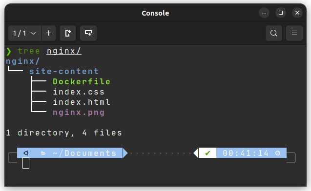
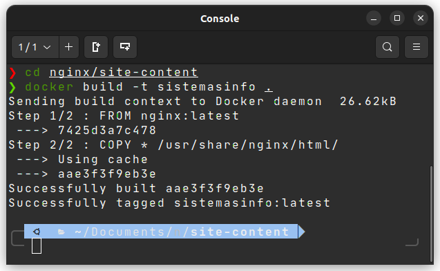

# Nginx en Docker

<details close>


<summary>  NGINX </summary>

Nginx (pronunciado "engine-x") es un servidor proxy inverso de código abierto para los protocolos HTTP, HTTPS, SMTP, POP3 e IMAP, así como un equilibrador de carga, caché HTTP y un servidor web (servidor de origen). El proyecto nginx comenzó con un fuerte enfoque en alta concurrencia, alto rendimiento y bajo uso de memoria. 
</details>

---

Para la presente práctica se pretende desplegar un servidor Nginx dentro de docker y visualizar un .html que le indicaremos. 

Crearemos una carpeta dentro de documentos llamada `nginx`. Dentro de este directorio creamos otro llamado `site-content` donde crearemos un *.html* que contendrá el contenido de la web. 

En este punto, en el mismo directorio crearemos un archivo llamado `Dockerfile` que tendra el siguiente contenido:

```docker
FROM nginx:latest
COPY * /usr/share/nginx/html/
```

> He hecho algunos cambios en el Dockerfile presentado en la guia del docente porque en mi .html hago uso de imágenes y hoja de estilo. 

Quedando un árbol de directorios así: 



Acudimos al emulador de terminal y ejecutamos el siguiente comando en la carpeta donde tenemos el `Dockerfile`: 

```docker
docker build -t sistemasinfo .
```

Deberá salirnos algo parecido a esto:



Como ultimo paso procedemos a ejecutar el siguiente comando:

```docker
docker run -it --rm -d -p 8080:80 --name web sistemasinfo
```

Obtenemos el siguiente resultado: 

